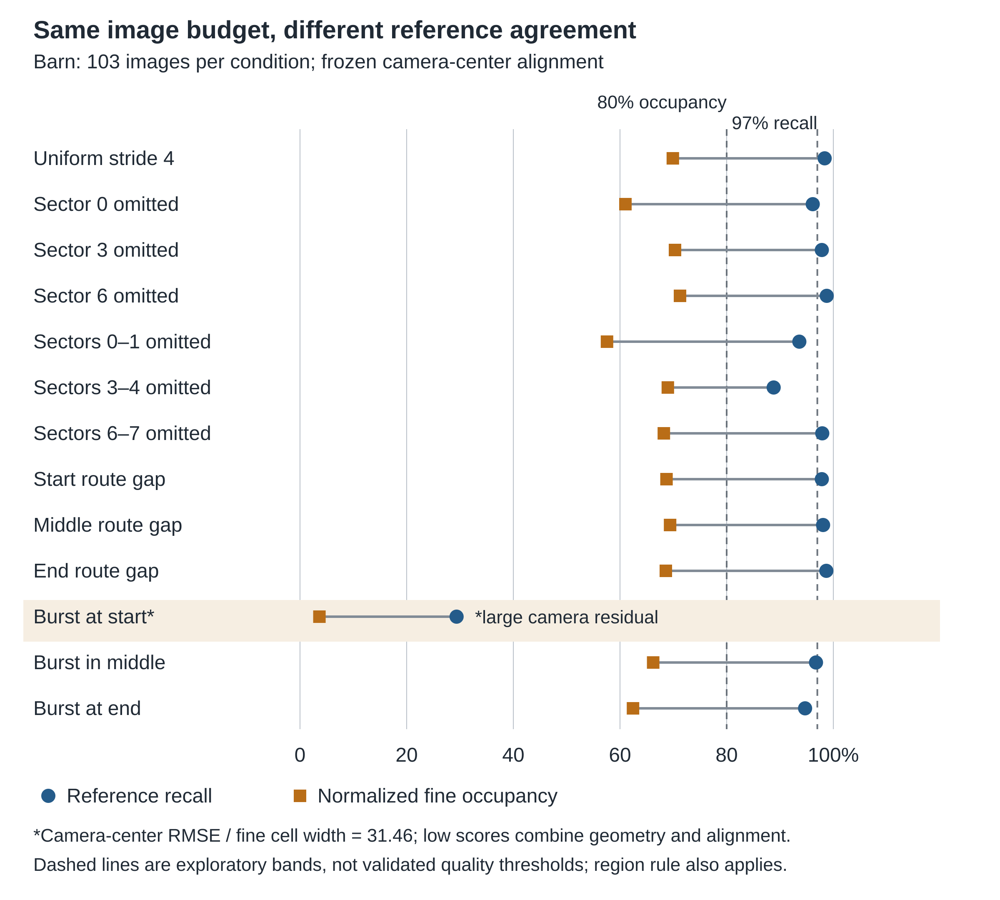
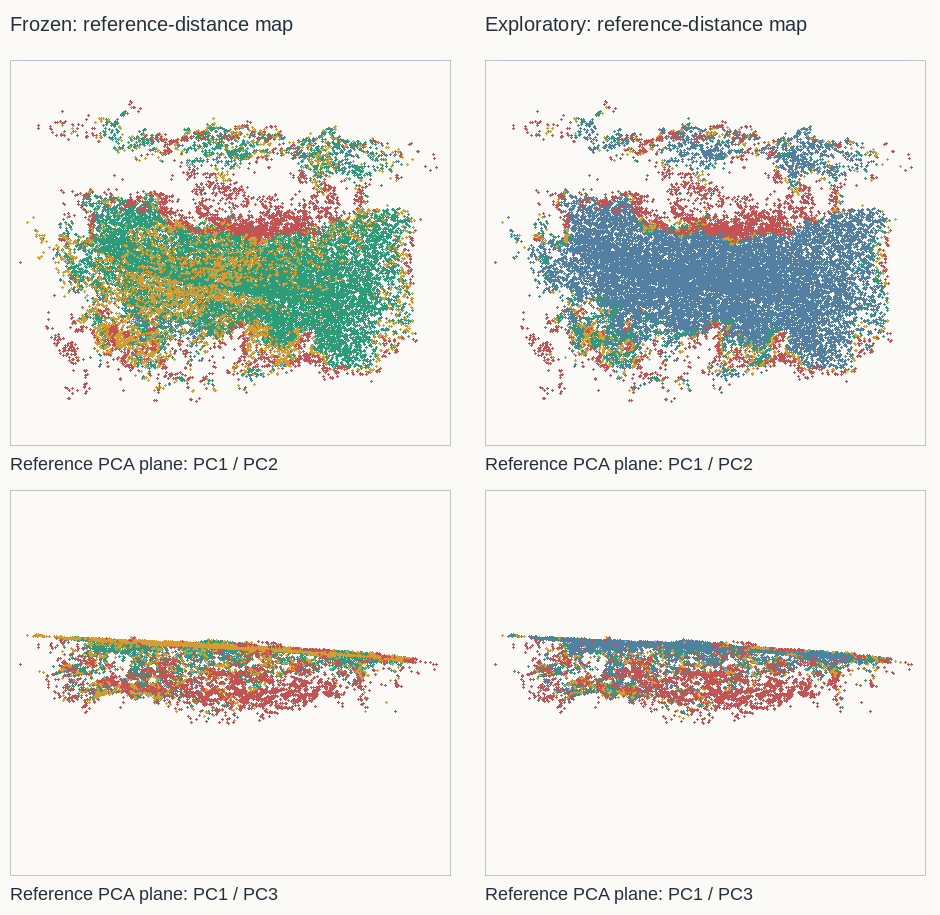

# Image Budget and Viewpoint Distribution in Photogrammetry: An Exploratory Study

**Ivan Roumec · Independent researcher · 7 October 2026**

Contact: ivanroumec@gmail.com · Codex/AI assistance acknowledged

**[Read the complete paper — 10-page PDF](manuscript.pdf)** · [Markdown manuscript](manuscript.md) · [Supplementary results](supplementary-results.md)

A personal exploratory study testing how image count and viewpoint distribution affect photogrammetric reconstruction—and whether successful registration is enough to judge the resulting geometry. The report is complete, not peer reviewed, and not intended for formal submission.

## Abstract

Image count alone does not describe the geometric support of a photogrammetric capture. We examine deterministic image removal from the 410-image Tanks and Temples Barn sequence using a fixed CUDA-enabled COLMAP pipeline. Sixteen reconstructions comprise a full-capture reference and 15 reduced conditions: uniform strides, angular-sector omissions, route gaps, and concentrated bursts. Evaluation separates internal reconstruction screening, one-way dense-reference recall, and normalized multi-scale voxel occupancy. A 137-image uniform subset achieved 99.5% recall and 80.9% fine occupancy; a 103-image uniform subset achieved 98.4% and 69.9%. Thirteen equal-budget 103-image conditions ranged from 29.4% to 98.8% recall despite all receiving a good internal verdict. However, the lowest-scoring burst also had a large camera-alignment residual, preventing attribution solely to missing geometry. Excluding that condition, recall still ranged from 88.8% to 98.8% and fine occupancy from 57.6% to 71.2%. A separate Helenenschacht stride-2 check registered 87 of 88 images but yielded 70.6% recall and 3.6% fine occupancy. Exploratory surface refinement increased these to 83.8% and 51.3% while worsening camera agreement. These observations support reporting internal consistency, reference agreement, spatial occupancy, and alignment diagnostics separately. The study is descriptive and scene- and recipe-specific: reconstructed references are not ground truth, quality bands are exploratory, and neither an optimal image selector nor general phone-video capture guidance is established.

## What the study asks

> How do image budget and distribution affect internal screening, dense-reference agreement, and spatial occupancy under one recorded reconstruction recipe?

The motivation is practical: many images concentrated in a short part of a capture route may provide different support from the same number distributed around a scene. This is a controlled test of particular reductions, not a proposal for a new optimal image-selection algorithm. Geometry-aware selection and the value of complementary overlap are established prior work.

## Study design

The primary dataset is the **410-image Tanks and Temples Barn sequence**. A full reconstruction provides the comparison reference; 15 reduced reconstructions test:

- **Uniform sampling:** every third, fourth, or fifth image, retaining 137, 103, or 82 images.
- **Angular omissions:** remove one sector or two adjacent sectors, then retain 103 images.
- **Route gaps:** remove a contiguous segment near the start, middle, or end, then retain 103 images.
- **Concentrated bursts:** place approximately half of a 103-image budget in one fifth of the route, at three different positions.

Including the uniform 103-image subset, **13 conditions hold image count constant** while changing its distribution. All Barn runs use the same CUDA-enabled COLMAP 4.1.0 pipeline, with exhaustive matching and 1200-pixel dense processing. Raw inputs remain immutable; selected images are represented by symlinks and recorded filename lists.

A separate **Helenenschacht aerial check** compares a full 176-image reconstruction with an 88-image stride-2 subset. Both use 1600-pixel dense processing, so this is a limited second-scene check rather than a replication of the entire Barn campaign. Ordered-image bursts are a video-like sampling proxy, not experiments on actual phone video or calibrated frame rates.

## What is measured

The report separates three diagnostic axes:

1. **Internal screening:** ReconCheck examines registration, reprojection error, tracks, view angles, camera-sector occupancy, and output availability. A good internal verdict describes support among the supplied images, not complete or accurate object recovery.
2. **Dense-reference recall:** after camera-center similarity alignment, measure how many sampled full-reference points lie within a declared distance of the subset cloud. Disagreement can mean missing geometry, displaced surfaces, alignment error, or reference error.
3. **Spatial occupancy:** measure overlap of occupied voxel cells at three scales, normalized against the reference's sampling support. This is not a validated measure of sharpness, texture, or perceptual detail.

The reference is another reconstruction, **not independently measured ground truth**. The exploratory completeness rule requires at least 97% recall and a largest disagreement component below 2%; preserved fine occupancy requires at least 80%. These are study-specific bands, not universal acceptance criteria.

## Main findings

### Image count alone did not predict the observed scores

A uniformly distributed 137-image subset met both declared bands. The 103-image uniform subset met the completeness rule but not preserved occupancy. At a fixed 103-image budget, different omissions and burst positions produced different reference agreement despite uniformly good internal screening.

Selected Barn results are shown below; the PDF contains all 16 rows.

| Barn condition | Images | Internal verdict | Reference recall | Fine occupancy |
|---|---:|---|---:|---:|
| Uniform stride 3 | 137 | good | 99.5% | 80.9% |
| Uniform stride 4 | 103 | good | 98.4% | 69.9% |
| Sector 6 omitted | 103 | good | 98.8% | 71.2% |
| Sectors 3–4 omitted | 103 | good | 88.8% | 69.0% |
| Burst at start* | 103 | good | 29.4% | 3.6% |
| Burst at end | 103 | good | 94.7% | 62.4% |

**The start burst is strongly alignment-confounded.** Its camera-center RMSE is 31.46 times the fine voxel width. Its low scores cannot be attributed solely to missing geometry or to cadence. Leaving that condition aside descriptively, the remaining equal-budget conditions still span **88.8–98.8% recall** and **57.6–71.2% fine occupancy**. Smaller camera residuals do not independently establish correct surface alignment.

*All conditions in the figure retain 103 images. Circles show reference recall; squares show normalized fine occupancy. Dashed lines are exploratory bands. Connecting lines join two different metrics, not confidence intervals.*

### Alignment materially changes the external-check scores

The Helenenschacht subset registered **87/88 images** and had full screening-sector coverage, yet its camera-aligned dense-reference scores were low. Exploratory rigid surface fitting improved surface agreement while worsening agreement between camera centers:

| Helenenschacht diagnostic | Frozen camera alignment | Exploratory surface refinement |
|---|---:|---:|
| Reference recall | 70.64% | 83.79% |
| Normalized fine occupancy | 3.62% | 51.33% |
| Camera-center RMSE, scene units | 0.04859 | 0.11952 |

Neither alignment is independently established as correct. The refinement optimizes against the same reconstructed reference used for scoring; **it is not a corrected ground-truth result or a replacement for the frozen measurements**. Both tested alignments fail the declared recall and occupancy bands.

*Shared PCA projections and fixed distance bands show improved agreement on the dominant near-planar surface, with peripheral disagreement remaining. Red denotes reference disagreement, not independently verified missing geometry. The [sensitivity report](../reports/helenenschacht-alignment-sensitivity.md) preserves the full overlay figure and method.*

## What the results mean—and do not mean

The useful takeaway is to **report internal consistency, reference recall, spatial occupancy, and alignment context separately**. Successful registration or mesh generation did not determine acceptance under the report's reference-based rules.

The study does **not** establish:

- An exact minimum image budget, optimal selector, or rule to retain one third of phone-video frames.
- Absolute geometric accuracy or the precise amount of genuinely missing surface.
- Perceptual usefulness, texture quality, or a validated detail-loss metric.
- Generalizable thresholds across scenes, materials, cameras, or reconstruction recipes.
- Repeat-run uncertainty or statistical significance; each condition has one deterministic reconstruction run.

Complementary overlap can help reconstruction. The bursts redistribute a fixed budget; they do not show that simply adding overlapping images is harmful. The 80.9% stride-3 occupancy result is also close to the exploratory 80% boundary, not a robust minimum-budget estimate.

## Evidence and scope

The paper includes mathematical metric definitions, ten bibliographic references, related-work distinctions, and an explicit limitations section. The public Barn artifacts preserve selection manifests, commands, outcomes, and reports. Large raw inputs and reconstructions remain outside Git; Helenenschacht's local manifests and outputs do not constitute a complete public replication package.

- [Supplementary results](supplementary-results.md) — complete multi-scale scores, alignment ratios, experiment IDs, and comparison-file hashes.
- [Final manuscript audit](manuscript-audit.md) — numerical checks and interpretation boundaries.
- [Literature evidence map](literature-review.md) and [subset/keyframe review](subset-keyframe-review.md) — verification scope and supported comparisons.
- [BibTeX references](references.bib) — the paper's ten citation records.

## Author and AI assistance

This was a personal exploratory project by **Ivan Roumec**, an independent researcher, to test ideas about photogrammetric capture. **Codex/AI tools assisted** with experiment planning, software development, analysis support, literature review, figures, and manuscript drafting/editing. AI assistance is acknowledged, not credited as co-authorship; responsibility remains with the human author.

The report and repository are the completed deliverable. No formal submission is planned. For document-maintenance details only, see [PDF rendering notes](rendering.md).
