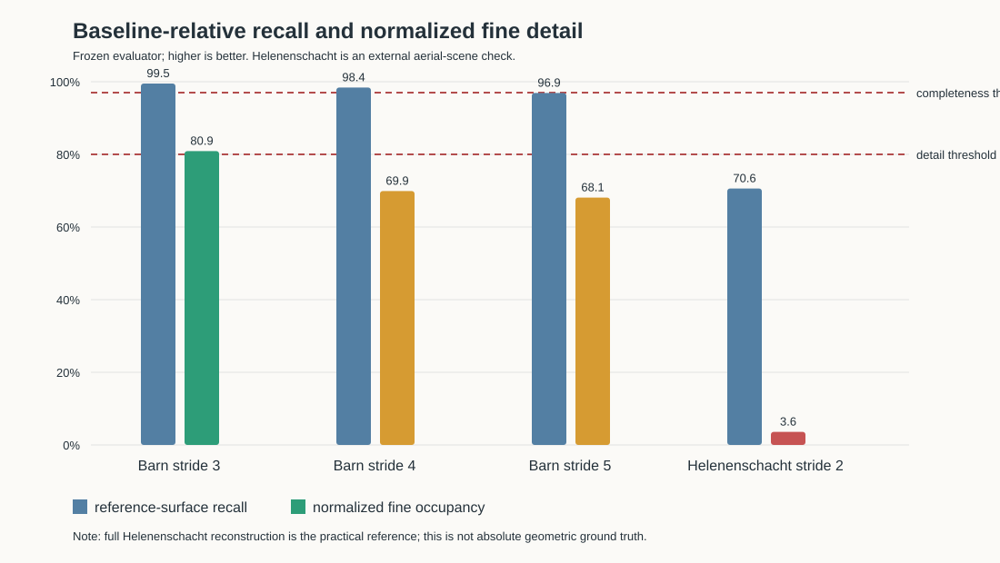
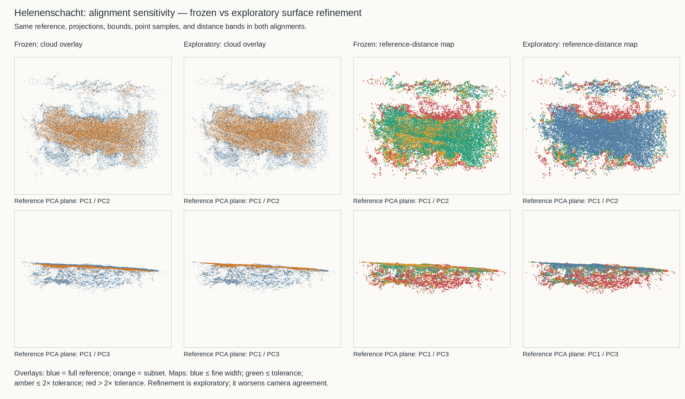

# Minimum Viable Capture Budgets for Low-Cost Photogrammetry: An Exploratory Study of Coverage, Image Count, and Capture Cadence

**Draft status:** Barn study and lightweight Helenenschacht check complete; initial cited literature map added. Full-paper review, direct subset/keyframe literature, figure validation, and editorial revision remain pending.

## Abstract

Low-cost photogrammetry guidance often emphasizes image count, but the spatial distribution and redundancy of those images may be equally important. We conducted a controlled exploratory study using the 410-image Tanks and Temples Barn sequence to evaluate uniform temporal reduction, missing angular coverage, contiguous route gaps, and uneven video-like capture cadence. Sixteen reconstructions—including a controlled full-capture reference and 15 reduced-capture conditions—were produced with one fixed CUDA-enabled COLMAP pipeline. Evaluation separated three concepts: internal reconstruction consistency, complete-object coverage against the aligned full-capture dense cloud, and retained spatial detail measured through normalized multi-scale voxel occupancy. Uniformly retaining one-third of the sequence preserved both object completeness and detail under the declared thresholds. Retaining one-quarter preserved the object but degraded detail. At the same 103-image budget, outcomes ranged from warning-level degradation to severe incompleteness depending on viewpoint distribution. The most extreme uneven-cadence condition retained only 29.4% of the reference surface and 3.6% normalized fine occupancy despite receiving a `good` internal-consistency verdict. These results show that nominal image count and successful reconstruction are insufficient indicators of practical output quality. For this scene, distinct and well-distributed viewpoints mattered more than redundant frames. A lightweight external check on the independent Helenenschacht aerial dataset retained 98.9% registration and full sector coverage but scored 70.6% reference-surface recall and 3.6% normalized fine occupancy under camera alignment. Exploratory surface refinement raised these scores to 83.8% and 51.3%, exposing alignment sensitivity; these scores therefore cannot isolate pure geometry or detail loss. The findings are scene- and pipeline-specific and do not establish universal thresholds or replace validation on actual phone video.

## 1. Introduction

Modern phones provide sufficient image resolution for many photogrammetry tasks, shifting the practical problem from sensor capability toward capture behavior. A user may collect hundreds of images or extract frames from video while still undersampling a side, corner, roof edge, or other geometrically important region. Conversely, a smaller but evenly distributed capture may retain enough overlap and viewpoint diversity for a useful reconstruction.

This study asks:

> Given a high-quality reference capture, how do image budget, viewpoint coverage, route gaps, and redundant video-like sampling affect complete-object reconstruction and retained detail?

The study makes three contributions:

1. A reproducible experiment contract that preserves immutable source data and records image selection, reconstruction commands, software versions, execution outcomes, and report fingerprints.
2. An evaluation that distinguishes internal structure-from-motion consistency from baseline-referenced object completeness and spatial detail fidelity.
3. An exploratory result showing that equal image counts can produce radically different outcomes when image distribution changes.

The work does not estimate absolute geometric accuracy. The full-capture reconstruction is a controlled reference, not laser-scanned ground truth. Results therefore quantify degradation relative to that reference and should not be interpreted as universal capture thresholds.

## 2. Related Work

### 2.1 Sparse and dense image-based reconstruction

Schönberger and Frahm [1] describe an incremental structure-from-motion pipeline addressing robustness, accuracy, completeness, and scalability. COLMAP's dense reconstruction work is attributed to Schönberger et al. [2]. These references establish the reconstruction background and software provenance, not the validity of the capture-budget thresholds proposed here.

### 2.2 Reference-based evaluation

Tanks and Temples [3] provides realistic indoor/outdoor reconstruction sequences and independently laser-scanned reference data. ETH3D [4] combines diverse scenes, high-resolution imagery, and multi-camera video with laser-scanned references. These benchmarks motivate distinguishing reconstruction output from independently assessed geometry. Our study instead measures retention relative to a full-capture reconstruction; its recall is therefore not equivalent to benchmark ground-truth accuracy.

### 2.3 View planning and mobile reconstruction

Scott et al. [5] frame view planning as selecting sensor poses for specified reconstruction or inspection goals. Their survey addresses active triangulation range sensors, so it provides conceptual context rather than direct evidence for passive phone photogrammetry budgets. Kolev et al. [6] describe confidence-weighted depth integration and visibility handling for interactive mobile reconstruction. This demonstrates the relevance of geometry and observation quality to mobile reconstruction without establishing a minimum frame count or video cadence.

### 2.4 Positioning and review gaps

Our current contribution is a reproducible, scene-specific ablation separating internal consistency, reference completeness, and normalized spatial occupancy. This initial review is based on verified bibliographic records and available abstracts; it is not a systematic or full-text literature review. Direct image-subset selection, video keyframe extraction, controlled overlap/baseline studies, and modern smartphone capture studies remain to be reviewed before asserting novelty or giving general phone-video guidance. Verification notes are maintained in `literature-review.md`.

## 3. Dataset and Controlled Reference

### 3.1 Dataset

The experiments use the Tanks and Temples Barn training image set [3]. The local immutable source contains 410 ordered JPEG images. The archive and image tree are identified by SHA-256 fingerprints in `datasets/tanks-and-temples-barn.json`; raw images are not stored in the research repository.

Every experiment materializes only symbolic links to selected source images. Each manifest records the complete selected filename list and a deterministic subset fingerprint. The raw image-tree fingerprint was checked throughout the study and remained unchanged.

### 3.2 Controlled reference reconstruction

The controlled reference experiment, `barn-full-controlled`, uses all 410 images. It registered 410/410 images and produced 206,930 sparse points, a fused dense cloud, and a Poisson mesh. Its ReconCheck internal-consistency verdict was `good`.

The controlled reference is used for relative completeness and detail comparisons. It is not ground-truth geometry and may contain its own reconstruction errors, smoothing, holes, and outliers.

## 4. Experimental Methodology

### 4.1 Reconstruction pipeline

Every Barn condition used COLMAP 4.1.0 with CUDA [1, 2] and the same pipeline:

1. GPU SIFT feature extraction with one shared camera model;
2. exhaustive GPU feature matching;
3. incremental sparse mapping;
4. image undistortion with a maximum image size of 1200 pixels;
5. GPU PatchMatch stereo;
6. stereo fusion at a maximum image size of 1200 pixels; and
7. Poisson meshing.

Commands, timestamps, exit codes, durations, logs, software versions, and output paths are recorded in each `execution.json`. ReconCheck 0.1.0 generated normalized diagnostics and internal quality reports.

### 4.2 Conditions

The completed study contains 16 reconstructions: one controlled reference and 15 experimental conditions.

#### Uniform temporal reduction

- `barn-stride-3`: 137 images, every third source frame (33.4%).
- `barn-stride-4`: 103 images, every fourth source frame (25.1%).
- `barn-stride-5`: 82 images, every fifth source frame (20.0%).

#### Single-sector omission at a fixed 103-image budget

Registered reference-camera centers were projected onto their best-fit PCA plane and partitioned into eight angular sectors. Images from sector 0, 3, or 6 were excluded, then 103 images were sampled evenly over the retained ordered trajectory.

#### Adjacent-sector omission at a fixed 103-image budget

The same process excluded sector pairs 0–1, 3–4, or 6–7.

#### Contiguous route gaps at a fixed 103-image budget

A contiguous 103-frame quarter was removed from the start, middle, or end of the ordered source sequence. The 103-image budget was then sampled evenly from the remaining trajectory.

#### Uneven video-like cadence at a fixed 103-image budget

Half of the image budget was concentrated inside one fifth of the ordered route, with the remainder sampled from the rest of the trajectory. The concentrated burst was positioned at the start, middle, or end. This is a temporal-sampling proxy; the source remains a still-image sequence and does not reproduce video compression, rolling shutter, or motion blur.

### 4.3 Internal-consistency evaluation

ReconCheck's `general-photogrammetry-v1` profile evaluates registration ratio, P95 reprojection error, median track length, median maximum view angle, camera-sector occupancy, and dense/mesh availability. This status describes whether the reconstruction is internally consistent for the images it received. It does not establish whether the complete intended object was reconstructed.

### 4.4 Baseline-referenced completeness

Experiment and reference coordinate systems were aligned with an Umeyama similarity transform estimated from camera centers shared by filename. Reference dense points were considered recovered when an aligned experiment point lay within 0.5% of the reference point-cloud bounding-box diagonal. The analysis reports:

- reference-surface recall;
- missing reference-surface fraction; and
- the largest connected missing region in a deterministic voxelization.

The exploratory decision rule was:

- **complete:** at least 97% recall and a largest connected missing region below 2% of the reference sample;
- **partially complete:** at least 95% recall and no connected missing region at or above 2%; and
- **incomplete:** all other results.

### 4.5 Detail fidelity

Detail fidelity was measured using deterministic voxel occupancy at three scales. The fine cell width was 0.25% of the reference bounding-box diagonal. Occupancy recall was normalized against the reference cloud's own deterministic sampling ceiling.

The exploratory bands were:

- **preserved:** normalized fine occupancy of at least 80%;
- **degraded:** 60% to below 80%; and
- **poor:** below 60%.

The task verdict was `good` only when completeness was complete and detail was preserved. A partially complete or detail-degraded result was `warning`; incomplete geometry or poor detail was `poor`.

These rules were calibrated during the exploratory study and frozen before the uneven-cadence conditions. A lightweight external check on Helenenschacht applied them without retuning.

## 5. Results

### 5.1 Complete result table

| Condition | Images | Internal | Task | Completeness | Detail | Surface recall | Fine occupancy |
|---|---:|---|---|---|---|---:|---:|
| Full controlled reference | 410 | good | good | complete | preserved | 100.0% | 100.0% |
| Uniform stride 3 | 137 | good | good | complete | preserved | 99.5% | 80.9% |
| Uniform stride 4 | 103 | good | warning | complete | degraded | 98.4% | 69.9% |
| Uniform stride 5 | 82 | warning | warning | partial | degraded | 96.9% | 68.1% |
| Sector 0 omitted | 103 | good | warning | partial | degraded | 96.1% | 61.0% |
| Sector 3 omitted | 103 | good | warning | complete | degraded | 97.8% | 70.3% |
| Sector 6 omitted | 103 | good | warning | complete | degraded | 98.8% | 71.2% |
| Sectors 0–1 omitted | 103 | good | poor | incomplete | poor | 93.6% | 57.6% |
| Sectors 3–4 omitted | 103 | good | poor | incomplete | degraded | 88.8% | 69.0% |
| Sectors 6–7 omitted | 103 | good | warning | complete | degraded | 97.9% | 68.2% |
| Start route gap | 103 | good | warning | complete | degraded | 97.8% | 68.7% |
| Middle route gap | 103 | good | warning | complete | degraded | 98.1% | 69.4% |
| End route gap | 103 | good | warning | complete | degraded | 98.7% | 68.6% |
| Burst at start | 103 | good | poor | incomplete | poor | 29.4% | 3.6% |
| Burst in middle | 103 | good | warning | partial | degraded | 96.8% | 66.2% |
| Burst at end | 103 | good | poor | incomplete | degraded | 94.7% | 62.4% |

**Figure 1.** Baseline-relative surface recall and normalized fine occupancy for uniform Barn reductions and the Helenenschacht external check. Dashed lines show the recall requirement and preserved-occupancy threshold; complete-object classification additionally requires a largest missing-region fraction below 2%. Helenenschacht bars retain the frozen camera-aligned scores. Diagnostic surface-refined scores are annotated separately, not substituted. The original occupancy score is alignment-sensitive and is not a pure detail-loss estimate.

### 5.2 Uniform temporal reduction

Uniform reduction produced the clearest budget trend. Retaining every third frame preserved 99.5% reference-surface recall and 80.9% normalized fine occupancy, meeting the exploratory `good` rule. Every fourth frame preserved the object at 98.4% recall but reduced fine occupancy to 69.9%, producing a warning for degraded detail. Every fifth frame reduced recall to 96.9% and fine occupancy to 68.1%; its internal verdict also dropped to warning because median track length fell from four to three.

For this scene, the useful distinction was not simply success versus failure. The 25% and 20% conditions remained recognizable and usable for some purposes, but did not preserve reference-level detail.

### 5.3 Angular coverage omissions

Single-sector omissions did not remove most of the object, but all three degraded detail. Surface recall ranged from 96.1% to 98.8%, while fine occupancy ranged from 61.0% to 71.2%.

Adjacent-sector omissions were strongly location dependent. Removing sectors 0–1 or 3–4 yielded incomplete results, including visually substantial missing Barn regions. Removing sectors 6–7 retained 97.9% surface recall but still degraded detail. Thus, the number of omitted sectors was not sufficient to predict outcome; the affected object region and visibility redundancy also mattered.

### 5.4 Contiguous route gaps

All three quarter-route gaps retained complete-object status, with surface recall from 97.8% to 98.7%. Nevertheless, fine occupancy clustered near 69%, and visual inspection showed softened or malformed local geometry. These conditions demonstrate why completeness and detail should be reported separately.

### 5.5 Uneven video-like cadence

Uneven cadence produced the largest variation at a constant 103-image budget. Concentrating half the budget near the start of the route was catastrophic: only 29.4% of the reference surface and 3.6% of normalized fine occupancy were retained. A middle burst retained 96.8% surface recall and 66.2% fine occupancy, while an end burst retained 94.7% and 62.4%, respectively.

All three conditions completed the full COLMAP pipeline, and all received an internal `good` verdict. This is the study's strongest evidence that nominal image count and internal reconstruction health do not establish complete-object usefulness.

### 5.6 Lightweight external validation

To test whether the frozen evaluation rules were specific only to Barn, we processed an independent 176-image aerial Helenenschacht dataset with the same broad COLMAP and ReconCheck workflow. A deterministic stride-2 subset used 88 symlinked images; the full 176-image reconstruction served as a practical reference. Both Helenenschacht runs used 1600-pixel dense processing, unlike the 1200-pixel Barn recipe; evaluation thresholds were unchanged. The subset registered 87/88 images, achieved full camera-sector coverage, and had a median view angle of 19.95°. Its internal status was nevertheless `warning` because P95 reprojection error was 2.266 px and median track length was 3 views.

After similarity alignment using 87 shared camera centers, reference-surface recall was 70.64%, the largest missing-region fraction was 29.29%, and normalized fine occupancy was 3.62%. The evaluator therefore classified the subset as incomplete with poor detail fidelity. The frozen scores indicate reference disagreement despite high registration, but must not be interpreted as pure missing geometry or detail loss. A subsequent exploratory rigid surface refinement raised recall to 83.79% and fine occupancy to 51.33%, while worsening camera-center RMSE from 0.0486 to 0.1195 scene units. Both tested alignments fail the acceptance thresholds, but the score magnitude is alignment-sensitive. Surface refinement is diagnostic, not a replacement for the frozen result or an independently verified alignment. See `reports/helenenschacht-alignment-sensitivity.md`.

**Figure 2.** Shared reference-derived PCA projections of the full and reduced Helenenschacht clouds before and after exploratory rigid surface refinement. Cloud overlays and reference-to-subset distance maps use common bounds and fixed distance bands. The dominant near-planar surface aligns better after refinement, while peripheral and below-plane disagreement persists. Red map points indicate reference disagreement, not independently verified missing geometry. Neither projection nor surface fitting establishes ground truth.

## 6. Discussion

### 6.1 Viewpoint distribution dominates nominal count

The 103-image conditions held image count constant while varying distribution. Their surface recall ranged from 29.4% to 98.8%, and fine occupancy ranged from 3.6% to 71.2%. The same image budget therefore supported outcomes from nearly complete to severely incomplete.

### 6.2 Completeness and detail are distinct

Several route-gap and sector conditions reconstructed the overall Barn while losing local detail. A binary success measure based on registration or output-file existence would miss this degradation. Reporting completeness and detail separately provides a more useful description of practical quality.

### 6.3 Internal consistency is necessary but insufficient

Except for stride 5, all reduced conditions retained an internal ReconCheck `good` verdict. Yet four task conditions were incomplete and received a poor task verdict under baseline-relative evaluation. Reprojection and track statistics describe consistency among selected images; they cannot reveal geometry that was never observed.

### 6.4 External validation and scope

The Helenenschacht check provides limited cross-scene support for separating evaluation axes: high registration and coverage coexisted with poor reference agreement. Alignment sensitivity substantially changed the scores, so this check does not independently establish how much disagreement represents absent geometry versus drift or residual alignment. It does not validate universal thresholds. Helenenschacht is an aerial dataset with different scene geometry, camera motion, and image characteristics from the Barn sequence, so the result is best treated as a transfer test rather than a phone-capture result.

### 6.5 Practical implication

For this scene, a distributed one-third sample was a stronger capture than several 103-image alternatives. The result supports guidance to prioritize complete loops, corners, roof lines, and distinct viewpoints, while avoiding long bursts of nearly redundant frames.

## 7. Reproducibility

The external validation is recorded in `reports/external-validation-helenenschacht-lite.md` and `reports/helenenschacht-stride-2-completeness.json`. The derived run contains the deterministic stride-2 manifest, symlinked image subset, exact pipeline script, stage logs, sparse model, dense cloud, and mesh.

Every experiment directory contains:

- `experiment-manifest.json`: hypothesis, selection parameters, complete filename lists, and subset fingerprint;
- `execution.json`: exact COLMAP commands, versions, timings, and stage outcomes;
- `reconcheck-quality-report.json`: internal quality diagnostics;
- `comparison.json`: baseline-relative completeness, detail, and task verdict; and
- `report.md`: a human-readable result.

The research repository contains deterministic selection code, schemas, tests, and CI for Linux, macOS, and Windows. Large reconstruction outputs remain derived local artifacts rather than versioned source inputs.

## 8. Threats to Validity

### 8.1 Scene and capture mismatch

The controlled study uses one Barn sequence, while the external check uses one aerial Helenenschacht dataset. This is evidence beyond Barn, but the scenes differ in geometry, trajectory, camera motion, and image characteristics. Neither supports universal thresholds across objects, interiors, vegetation, reflective materials, urban scenes, or handheld phone video.

### 8.2 Reference rather than ground truth

The full-capture dense cloud is not an independent geometric truth. Relative recall can reward errors shared with the reference and penalize valid differences. No dimensional or survey-grade accuracy claim is made.

### 8.3 Proxy for phone video

Uneven-cadence conditions select ordered still images. They do not model phone-video compression, rolling shutter, motion blur, autofocus transitions, stabilization, exposure changes, or variable frame timing.

### 8.4 Exploratory threshold calibration

Completeness and detail thresholds were calibrated after inspecting initial conditions and visual outputs, then frozen before the final cadence tests and Helenenschacht check. This reduces their confirmatory strength and creates a risk of overfitting to the tested scenes. A larger preregistered multi-scene study is still required.

### 8.5 No stochastic repetitions

The completed conditions are deterministic, but reconstruction stochasticity and sensitivity to numerical/platform variation were not estimated through repeated runs. Random-subset conditions planned in the broader protocol were not part of this completed core study.

### 8.6 Reconstruction recipe dependence

Results depend on COLMAP 4.1.0, exhaustive matching, shared-camera assumptions, 1200-pixel dense processing, PatchMatch settings, stereo fusion, and Poisson meshing. Different recipes may shift the observed thresholds.

### 8.7 Detail metric limitations

Voxel occupancy measures spatial support, not texture quality, surface-normal error, edge sharpness, topology, or perceptual quality. Fine occupancy may be affected by outliers and density differences despite sampling normalization. It is also sensitive to residual alignment error and voxel-grid phase. In Helenenschacht, camera-center alignment RMSE (0.0486 scene units) is approximately 90% of the fine voxel width (0.0542), so its 3.62% occupancy score cannot be attributed to lost detail alone. Tested grid phases produced 3.45–3.62%, but exploratory surface refinement increased occupancy to 51.33%. This confirms alignment sensitivity rather than establishing a correct alternative alignment. Camera-center residuals are not direct surface-error estimates.

## 9. Practical Implications

The exploratory evidence supports the following scene-specific guidance:

1. Distribute images around the full object instead of maximizing raw frame count.
2. Avoid allowing half of a capture budget to accumulate in one short route segment.
3. Capture corners, roof intersections, eaves, and other visibility-sensitive geometry from multiple oblique viewpoints.
4. Treat successful registration and mesh generation as necessary checks, not proof of a complete or detailed result.
5. Inspect both missing-region coverage and local detail before accepting a reconstruction.

## 10. Conclusion

A low image budget can produce a useful reconstruction when viewpoints remain distinct and evenly distributed. In the Barn study, a uniform one-third sample preserved both object completeness and the declared level of detail, while a one-quarter sample preserved the object but degraded detail. At the same 103-image budget, uneven sampling and missing angular coverage produced outcomes ranging from warning-level degradation to severe incompleteness. The practical minimum was therefore governed by viewpoint distribution as much as by image count.

The frozen evaluation rules transferred to one lightweight external scene check, but broader validation remains necessary. The next steps are verified literature review, figures, and controlled experiments with actual phone video across multiple scenes.

## Data and Artifact Availability

- Research repository: <https://github.com/Gre3nLioN/photogrammetry-capture-research>
- Quality instrument: <https://github.com/Gre3nLioN/reconcheck>
- Dataset source: <https://www.tanksandtemples.org/download/>

## References

1. Schönberger, J. L., and Frahm, J.-M. (2016). *Structure-from-Motion Revisited*. CVPR, 4104–4113. <https://doi.org/10.1109/CVPR.2016.445>
2. Schönberger, J. L., Zheng, E., Frahm, J.-M., and Pollefeys, M. (2016). *Pixelwise View Selection for Unstructured Multi-View Stereo*. ECCV. <https://doi.org/10.1007/978-3-319-46487-9_31>
3. Knapitsch, A., Park, J., Zhou, Q.-Y., and Koltun, V. (2017). *Tanks and Temples: Benchmarking Large-Scale Scene Reconstruction*. ACM Transactions on Graphics, 36(4). <https://doi.org/10.1145/3072959.3073599>
4. Schöps, T., Schönberger, J. L., Galliani, S., Sattler, T., Schindler, K., Pollefeys, M., and Geiger, A. (2017). *A Multi-View Stereo Benchmark with High-Resolution Images and Multi-Camera Videos*. CVPR, 3260–3269. <https://doi.org/10.1109/CVPR.2017.272>
5. Scott, W. R., Roth, G., and Rivest, J.-F. (2003). *View Planning for Automated Three-Dimensional Object Reconstruction and Inspection*. ACM Computing Surveys. <https://doi.org/10.1145/641865.641868>
6. Kolev, K., Tanskanen, P., Speciale, P., and Pollefeys, M. (2014). *Turning Mobile Phones into 3D Scanners*. CVPR, 3946–3953. <https://doi.org/10.1109/CVPR.2014.504>

Machine-readable records: `references.bib`. Verification scope and outstanding review tasks: `literature-review.md`.
